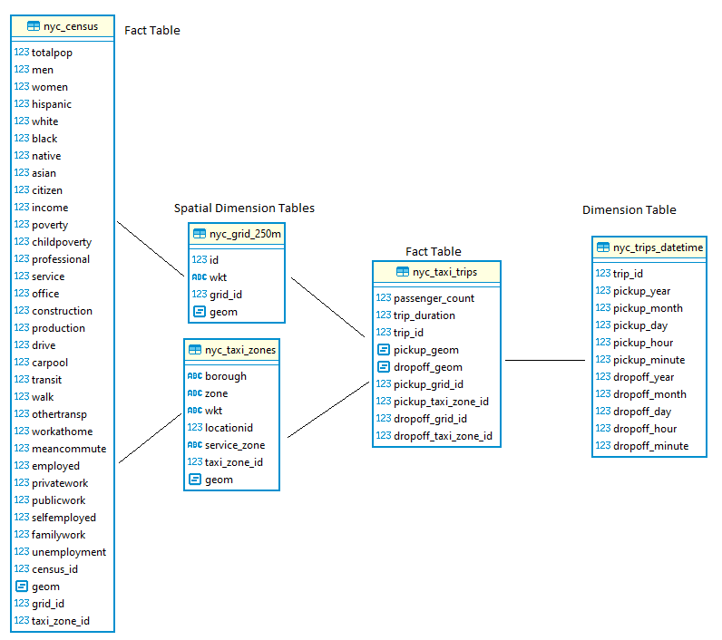

# Udacity Final Project - a Discussion

- [Udacity Final Project - a Discussion](#udacity-final-project---a-discussion)
  - [Intro](#intro)
  - [Scoping The Project](#scoping-the-project)
  - [Addressing Other Scenarios](#addressing-other-scenarios)
    - [The data was increased by 100x](#the-data-was-increased-by-100x)
    - [The pipelines would be run on a daily basis by 7 am every day](#the-pipelines-would-be-run-on-a-daily-basis-by-7-am-every-day)
    - [The database needed to be accessed by 100+ people](#the-database-needed-to-be-accessed-by-100-people)
  - [Defending Decisions](#defending-decisions)
    - [The Tools](#the-tools)
    - [Data Model](#data-model)

## Intro

The following discussion was made for Udacity final project :
 
> In this project, you can choose to complete the project provided for you, or define the scope and data for a project of your own design. Either way, you'll be expected to go through the same steps outlined below.
(Udacity.com)

I choose to to an open-ended project, based on idea I saw at [Carto's blog](https://carto.com/blog/site-planning-coverage-optimization-mobility-data/). There project  try to assest market coerage and find best location for the markets. The following discussion talks about the project scope, possible scenarios, the tools and the schema of the project.   

----

## Scoping The Project

The goal of the porject was to create a data warehouse for urban analyst for location optimization and site planning. Because of that the warehouse will mostly be use for analsys. 

The steps I took while working on the project:

1. Identify & Gather Data - In my case i used Carto's blog post for inspiration. They suggest few dataset they used for their case. Based on Carto's ideas I look for data of New-York city. The main advantage of NYC data is it open and large enough to work with.   
2. Explore the Data - I try to understand the steps I will need to take to reach my goal data model, and the needed cleaning. This part can be found in a Jupyter's notebook. 
3. Define The Data Model - This was the most challenging part, to understand how I want the final database to look like. In the end I decided using *galaxy schema*. More about that in the last part of topic. After understanding the data moedl I build on that and my understanding of the data, and divide the project to small tasks. They can be found in the *notebook etl*.
4. Coding:
   1. the etl
   2. bugs fix
5. Running the code      

------

## Addressing Other Scenarios

### The data was increased by 100x

How will it be happend - I used a dataset which include only a small (~1m) subset of NYC taxi trips, but in NYC open data website one can find datasets with than 110 milion rows for one year and one type of taxi zone. Becuase of that the database can easily include around 1 billion rows.

Logical approach - In that case in may be best to move from PostgreSQL to Spark. One of the main reasons to use PostgreSQL was PostGIS. Spark has alternatives for PostGIS. I will read the data into PySpark dataframe and do the coding using PySpark. One example of analsys of geography data can be found on [Anita Graser blog](https://anitagraser.com/2019/12/07/getting-started-with-pyspark-geopandas-on-databricks/). 

### The pipelines would be run on a daily basis by 7 am every day

How will it be happend - another possible case is data gathering by senseor/camarea or a survey, for example a count of pedestrian/cars in differnt time of the day. The analsysts may be want the newer data fast to improve their predictions.

Logical approach - I will use a platform similar to Apache Airflow to schedule and monitor the workflows. Becuase of the code was written in a modular approche, I will need to convert the functions to DAG tasks and plugins. 

### The database needed to be accessed by 100+ people

How will it be happend - my dataset is varied and can include many datasets to help understand the area of interest. 

Logical approach - one possible sultion for this case will be improve the database availability by replicate it on multiple servers. PostgreSQL itself has more than one sultion:
    * [How to Deploy PostgreSQL for High Availability](https://severalnines.com/database-blog/how-deploy-postgresql-high-availability).
    * [How to Achieve PostgreSQL High Availability with pgBouncer](https://severalnines.com/database-blog/how-achieve-postgresql-high-availability-pgbouncer)

-----

## Defending Decisions

### The Tools

**Postgres** 
   > PostgreSQL, as the most advanced open source database, is so flexible that can serve as a simple relational database, a time-series data database, and even as an efficient, low-cost, data warehousing solution. You can also integrate it with several analytics tools.

   Source: [severalnines.com](https://severalnines.com/database-blog/running-data-warehouse-postgresql)

   As cited Postgres has a lot of benefits for data warehouse. In my case one important benefit PostgresSQL extensibility. I used PostGIS which is a spatial database extender. It adds support for geographic objects allowing location queries to be run in SQL. It add spatial functions, geometric types and spatial indexing. When using with SQL it simplfy the analsys job and improve it. My dataset the geographic part is important, for example when I join the fact tables with spatial dimension tables to get the Primary Key. 

   Spark has alternative, but PostGIS is stronger and can be work with Qgis, geographic information system that can be used as desktop software.  

   

### Data Model

 
> Star schema is a well-known data model used in data warehousing for BI solutions, organizes data into several fact tables referencing one or more dimension tables.
> 
Source: [A Star Schema for Utility Network Analysis and Visualisation in a Geo-Business Intelligence Environment](https://www.researchgate.net/publication/267324424_A_Star_Schema_for_Utility_Network_Analysis_and_Visualisation_in_a_Geo-Business_Intelligence_Environment)

 The main issue I found at first was there is no link between the census data to the taxi trips data. Becuaes of that I used  *galaxy schema*. *galaxy schema* is a type of star schema which include two fact table that share dimension tables between them.  
 
 In the research cited above the researchers propose a star schema that can incorporate geometry data along with other attributes. In Carto's blog they describe how they use a grid to help them analyze and locate best places. As shown in the project schema the grid and taxi zones tables use as spatial dimension tables. 

 The spatial dimension tables connect to the fact tables by primary key (grid_id, taxi_zone_id) and allow the end-users faster join and less spatial analsys that can take time and require some knowldege.

 excpet of geometric and what discuss above, the fact tables include only a metric attributes.    

.